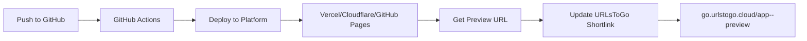

# Dynamic Preview Links

Automatically update URLsToGo shortlinks when your preview deployments complete. Never update URLs manually again!

## Overview

Preview links are special URLsToGo shortlinks that automatically update to point to your latest preview deployment. They follow the pattern:

```
go.urlstogo.cloud/{repo-name}--preview
```

Examples:
- `go.urlstogo.cloud/bricks-cc--preview` → Latest preview of bricks-cc
- `go.urlstogo.cloud/jb-cloud-app-tracker--preview` → Latest preview of jb-cloud-app-tracker

## How It Works



1. **You push code** to a branch (e.g., `preview` or any feature branch)
2. **GitHub Actions triggers** the update workflow
3. **Deployment completes** on your platform (Vercel/Cloudflare/GitHub Pages)
4. **Preview URL is detected** (e.g., `bricks-cc-git-branch-user.vercel.app`)
5. **URLsToGo API is called** to update `{repo-name}--preview`
6. **Shortlink now points** to the latest preview URL

## Supported Platforms

- ✅ **Vercel** - Detects preview URLs automatically
- ✅ **Cloudflare Pages** - Constructs preview URLs from branch names
- ✅ **GitHub Pages** - Uses repository GitHub Pages URL

## Setup Guide

### Step 1: Create an API Key

1. Go to [go.urlstogo.cloud/admin](https://go.urlstogo.cloud/admin)
2. Click **API Keys** (in the top-right menu)
3. Create a new key:
   - **Name:** `my-app-preview` (or your repo name)
   - **Scopes:** `read,write` (default)
   - **Expires:** (optional, leave blank for no expiration)
4. **Save the key immediately** - it won't be shown again!
   - Format: `utg_xxxxxxxxxxxxxxxxxxxxxxxxxxxxxxxxxxxxxxxxxxxxxxxxxxxxxxxxxxxxxxxx`

### Step 2: Add GitHub Secret

1. Go to your project repository on GitHub
2. Navigate to **Settings** → **Secrets and variables** → **Actions**
3. Click **New repository secret**
4. Add:
   - **Name:** `URLSTOGO_API_KEY`
   - **Value:** Your API key from Step 1 (e.g., `utg_abc123...`)

### Step 3: Add Workflow to Your Repo

1. In your project repo, create the workflow directory:
   ```bash
   mkdir -p .github/workflows
   ```

2. Copy the template:
   ```bash
   # From URLsToGo repo
   cp templates/update-preview-link.yml /path/to/your-repo/.github/workflows/
   ```

   Or download directly:
   ```bash
   curl -o .github/workflows/update-preview-link.yml \
     https://raw.githubusercontent.com/Aventerica89/URLsToGo/main/templates/update-preview-link.yml
   ```

3. **No customization needed!** The workflow auto-detects:
   - Repository name (used for shortlink code)
   - Deployment platform (Vercel/Cloudflare/GitHub Pages)
   - Preview URL

### Step 4: Deploy and Test

1. Push a change to any branch:
   ```bash
   git checkout -b test-preview
   git commit --allow-empty -m "Test preview link"
   git push origin test-preview
   ```

2. Check GitHub Actions:
   - Go to **Actions** tab in your repo
   - Watch the "Update Preview Link" workflow run
   - Should complete in ~30 seconds

3. Visit your preview link:
   ```
   https://go.urlstogo.cloud/{your-repo-name}--preview
   ```

## Advanced Configuration

### Custom Repository Name

If your repo name doesn't match the desired shortlink:

```yaml
env:
  REPO_NAME: custom-name  # Will create "custom-name--preview"
```

### Specify Deployment Platform

If auto-detection fails, explicitly set the platform:

```yaml
env:
  DEPLOYMENT_PLATFORM: vercel  # or cloudflare-pages, github-pages
```

### Custom Cloudflare Pages Project

Cloudflare Pages preview URLs are constructed from the project name:

```yaml
# Default: {branch}.{repo-name}.pages.dev
# Custom:
- name: Detect deployment URL
  id: detect-url
  run: |
    CF_PROJECT="my-custom-project"
    DEPLOYMENT_URL="https://${BRANCH_NAME}.${CF_PROJECT}.pages.dev"
```

### Trigger on Specific Branches Only

```yaml
on:
  push:
    branches:
      - preview
      - staging
      # Remove: - 'preview/**'
```

## API Reference

### Create/Update Preview Link

```http
PUT /api/preview-links/{code}
Authorization: Bearer utg_xxxxx
Content-Type: application/json

{
  "destination": "https://app-git-branch-user.vercel.app"
}
```

**Requirements:**
- `code` must end with `--preview`
- Must be authenticated with valid API key
- `destination` must be a valid URL

**Response (200 OK):**
```json
{
  "success": true,
  "action": "created", // or "updated"
  "code": "my-app--preview",
  "destination": "https://app-git-branch-user.vercel.app",
  "url": "https://go.urlstogo.cloud/my-app--preview"
}
```

**Error Responses:**

- `400 Bad Request` - Code doesn't end with `--preview` or invalid URL
- `401 Unauthorized` - Invalid or missing API key
- `403 Forbidden` - Preview link belongs to another user

### Example: Using curl

```bash
curl -X PUT https://go.urlstogo.cloud/api/preview-links/my-app--preview \
  -H "Authorization: Bearer utg_xxxxx" \
  -H "Content-Type: application/json" \
  -d '{"destination":"https://my-app-git-preview-user.vercel.app"}'
```

### Example: Using JavaScript (fetch)

```javascript
const response = await fetch('https://go.urlstogo.cloud/api/preview-links/my-app--preview', {
  method: 'PUT',
  headers: {
    'Authorization': `Bearer ${process.env.URLSTOGO_API_KEY}`,
    'Content-Type': 'application/json'
  },
  body: JSON.stringify({
    destination: 'https://my-app-git-preview-user.vercel.app'
  })
});

const data = await response.json();
console.log('Preview link:', data.url);
```

## Troubleshooting

### Workflow runs but link not updated

**Check API key:**
```bash
# Test API key
curl -H "Authorization: Bearer utg_xxxxx" \
  https://go.urlstogo.cloud/api/keys
```

If you get `401 Unauthorized`, regenerate your API key.

### "Could not detect deployment platform"

**Solution:** Explicitly set `DEPLOYMENT_PLATFORM`:

```yaml
env:
  DEPLOYMENT_PLATFORM: vercel  # or cloudflare-pages, github-pages
```

### Wrong preview URL detected

**For Vercel:** Check that you're using the correct Vercel account name in the URL pattern.

**For Cloudflare Pages:** Customize the `CF_PROJECT` variable to match your project name.

**For GitHub Pages:** Ensure GitHub Pages is enabled in your repo settings.

### Preview link shows old deployment

- Check that the workflow completed successfully (GitHub Actions → Latest run)
- Verify the API call returned `200 OK` in the workflow logs
- Visit the shortlink: `https://go.urlstogo.cloud/app--preview`
- It should redirect immediately to the new URL

### Rate limiting

By default, the API allows:
- **30 link updates per minute** per user

If you hit this limit, the workflow will fail with `429 Too Many Requests`. Wait 60 seconds and re-run the workflow.

## Use Cases

### 1. Share Preview with Team

**Before:**
> "Hey team, check out the preview at `https://bricks-cc-git-fix-auth-bug-aventerica89.vercel.app`"

**After:**
> "Hey team, check out the preview at `go.urlstogo.cloud/bricks-cc--preview`"

The link stays the same, but always points to the latest preview!

### 2. Bookmark Preview in Browser

Bookmark `go.urlstogo.cloud/my-app--preview` to always access your latest work-in-progress.

### 3. Test on Mobile Devices

Share the short, stable link with your phone or tablet. No need to type long Vercel URLs on mobile keyboards!

### 4. Client Presentations

Give clients a stable preview link that always shows the latest version without updating your presentation slides.

### 5. Integration Testing

Use preview links in your E2E tests:

```javascript
// Cypress test
describe('Preview deployment', () => {
  it('should load preview app', () => {
    cy.visit('https://go.urlstogo.cloud/my-app--preview');
    cy.contains('Welcome').should('be.visible');
  });
});
```

## FAQ

**Q: Can I have multiple preview links per repo?**

A: Yes! Create links with different suffixes:
- `my-app--preview` (default)
- `my-app--staging--preview`
- `my-app--feat-x--preview`

Just update the `REPO_NAME` env var in each workflow.

**Q: Does this work with private repos?**

A: Yes! The workflow runs inside your repo's GitHub Actions, so it has access to your code and secrets.

**Q: Can I delete a preview link?**

A: Yes, delete it like any other link:
1. Go to [go.urlstogo.cloud/admin](https://go.urlstogo.cloud/admin)
2. Search for `app--preview`
3. Click the delete button

**Q: Can I manually update a preview link?**

A: Yes! Use the API directly:
```bash
curl -X PUT https://go.urlstogo.cloud/api/preview-links/my-app--preview \
  -H "Authorization: Bearer utg_xxxxx" \
  -d '{"destination":"https://new-url.com"}'
```

**Q: Are preview links protected by password?**

A: No, preview links are public by default. If you need password protection, create a regular link instead and update it manually.

**Q: Can I see analytics for preview links?**

A: Yes! Preview links track clicks just like regular links. View analytics in the URLsToGo admin dashboard.

## Examples

### Example 1: Vercel App

Repository: `Aventerica89/bricks-cc`

**GitHub Actions Workflow:**
- Triggers on push to any branch
- Detects Vercel preview URL: `bricks-cc-git-[branch]-aventerica89.vercel.app`
- Updates: `go.urlstogo.cloud/bricks-cc--preview`

### Example 2: Cloudflare Pages App

Repository: `Aventerica89/jb-cloud-app-tracker`

**GitHub Actions Workflow:**
- Triggers on push to `preview` branch
- Constructs Cloudflare Pages URL: `preview.jb-cloud-app-tracker.pages.dev`
- Updates: `go.urlstogo.cloud/jb-cloud-app-tracker--preview`

### Example 3: GitHub Pages Docs Site

Repository: `Aventerica89/my-docs`

**GitHub Actions Workflow:**
- Triggers on push to `main` branch
- Uses GitHub Pages URL: `aventerica89.github.io/my-docs`
- Updates: `go.urlstogo.cloud/my-docs--preview`

## Next Steps

1. ✅ Set up your first preview link (follow the setup guide above)
2. 📚 Explore the [API documentation](../MANUAL.md#api-documentation)
3. 🎨 Customize the [workflow template](../templates/update-preview-link.yml)
4. 🐛 Report issues on [GitHub](https://github.com/Aventerica89/URLsToGo/issues)

---

**Need help?** Open an issue or ask Claude! 🚀
